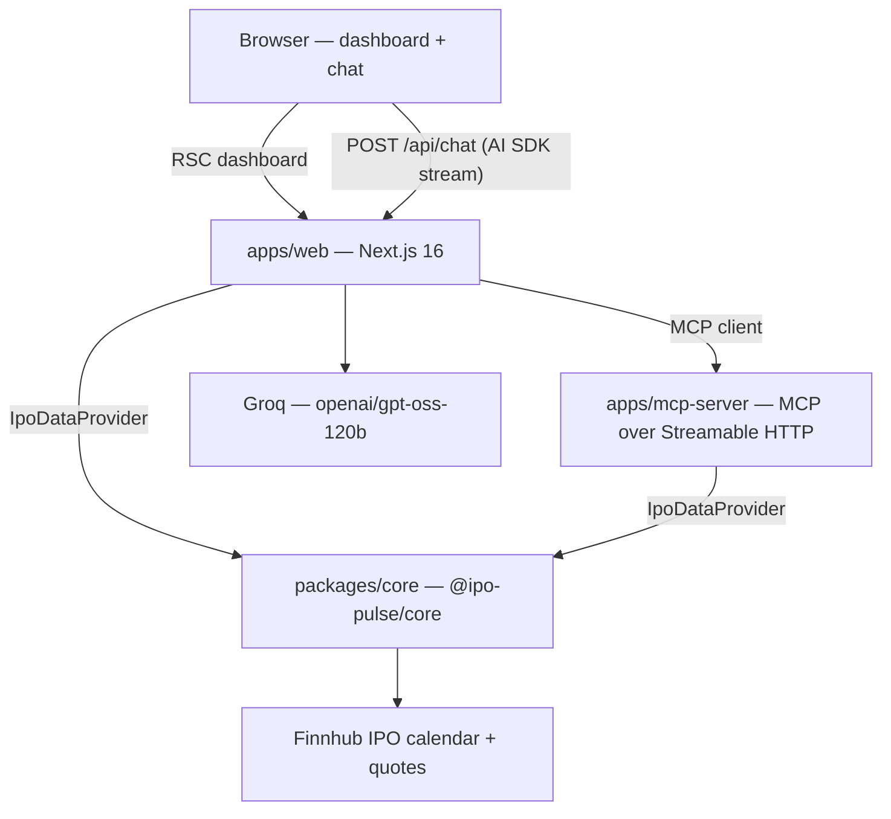

# IPO Pulse

US IPO dashboard plus an AI chat that answers from **live Finnhub data**, not model memory.

The chat never invents prices or dates: Groq calls read-only MCP tools, and every answer is supposed to cite the source and `asOf` timestamp. The UI is not investment advice and the agent refuses buy/sell questions.

**Status:** v1 of the product is implemented and [CI is green](https://github.com/hariDev1049/ipo-pulse/actions). There is no public demo yet — run it locally (below).

## What it does

- Calendar of US IPOs (upcoming / recent / all) with date range, status chips, and SPACs hidden by default.
- Dashboard charts from the same calendar: counts and disclosed value by month, status mix, exchange mix, listing performance vs IPO midpoint.
- Streaming chat with **tool-call cards** (pending → done) so you can see which MCP tool ran and what it returned.

Try questions like:

- Which IPOs open this week? Cite the source and date.
- What is the price range and share count for TRex Bio?
- How have last month's priced IPOs performed since listing?

## Architecture



| Piece | Role |
|---|---|
| `packages/core` | Types, Zod at the Finnhub boundary, `FinnhubProvider`, in-memory TTL cache. |
| `apps/mcp-server` | Four read-only tools over `IpoDataProvider`. Any MCP client can use it (this app, Cursor, inspectors). |
| `apps/web` | Dashboard loads calendar/quotes **through core**, not MCP. Chat goes LLM → MCP → core. |

**Why the dashboard does not call MCP:** the table should render even if the chat stack is down, and the two apps can be deployed independently later. Cost: each process has its own cache. That is acceptable for v1.

**Why an adapter:** tools and the dashboard never import Finnhub URLs. A later India provider is a new `IpoDataProvider` implementation, not a rewrite of the UI or tools. Tools are unit-tested with a fake provider.

## Monorepo

```text
ipo-pulse/
├─ packages/core          @ipo-pulse/core
├─ apps/mcp-server        MCP HTTP server (default :3001/mcp)
├─ apps/web               Next.js App Router (default :3000)
├─ .env.example
└─ .github/workflows/ci.yml
```

pnpm workspaces (`apps/*`, `packages/*`). Node **24**, pnpm **11.7.0** (pinned in root `package.json` `packageManager`).

## MCP tools (read-only)

| Tool | Default window | Notes |
|---|---|---|
| `get_upcoming_ipos` | next 14 days | `expected` or `priced`, date ≥ today |
| `get_recent_ipos` | last 30 days | `priced`, date &lt; today |
| `get_ipo_details` | ~1y back / 6m forward | ticker or company name, max 5 matches |
| `get_listing_performance` | — | midpoint of offer range vs live quote |

Every result includes `source` (Finnhub) and `asOf`. SPACs are omitted unless `includeSpacs: true`.

## Data and parsing

Finnhub’s calendar is messy. The mapper **parses** rather than rejecting the whole payload:

- `price` may be `"14.00-16.00"`, `"10.00"`, or empty → `{ low, high } | null`.
- `symbol` / `exchange` / share count are often empty on `filed` / `withdrawn` rows.
- Unknown `status` values are skipped, not thrown.
- Dates are timezone-naive `YYYY-MM-DD`. The app treats them as UTC and never does `new Date("YYYY-MM-DD")` (that parses as local midnight and shifts the calendar).

**SPAC heuristic** (Finnhub has no flag): name contains “Acquisition”, or offer price is exactly `$10` **and** the symbol ends in `U` (units). There will be rare false positives; the UI can still show SPACs with the toggle.

**Cache** (`CachedProvider`): calendar 1 hour, quotes 60 seconds, in-memory, per process. That stays under Finnhub’s free-tier ~60 req/min without pretending the cache is shared across instances.

## Chat guardrails

The Groq system prompt requires:

- Answers only from tool results; never invent numbers.
- Cite source and `asOf`.
- Refuse investment advice.
- Keep SPACs hidden unless the user asks.

The model may take up to 8 tool steps (`stopWhen: stepCountIs(8)`). Temperature is 0.

API keys stay server-side. There are no `NEXT_PUBLIC_` secrets.

## Design trade-offs

| Choice | Why | Cost |
|---|---|---|
| US / Finnhub now, India later | Official API, recruiter-usable demo data. Scraping NSE/Chittorgarh is off the table (ToS + fragility). | US-only calendar; many `filed` rows have no venue. |
| Shared core package | One parser and type system for dashboard and tools. | Two caches (web + MCP). |
| MCP as its own app | Tools are reusable; chat and dashboard fail independently. | You must run two processes locally. |
| Hide SPACs by default | They dominate the calendar and are not operating companies. | Heuristic, not a vendor flag. |
| Root `pnpm -r` CI, no Turborepo | Three packages do not need a remote task cache yet. | Full typecheck/lint/test on every push. |
| Next.js `cacheComponents` | Matches current App Router defaults. | `connection()` on request-time data; Chrome “Disable cache” in DevTools bypasses Next’s **dev** caches (unrelated to `CachedProvider`). |

## Limitations

- Not investment advice. Public market data only.
- US coverage. Indian IPOs are a future provider, not a scrape.
- New listings often have no Finnhub quote yet — performance rows can be empty.
- Exchange mix shows a large **Unknown** bucket because many `filed` rows have no venue.
- In-memory TTL cache does not survive restarts and is not shared between web and MCP.
- Chat returns 500 if `GROQ_API_KEY` is missing or the MCP server is down.
- No watchlist, alerts, or auth.

## Setup

1. Install [Node.js 24](https://nodejs.org/) and [pnpm 11.7.0](https://pnpm.io/) (`corepack enable` then `corepack prepare pnpm@11.7.0 --activate` works).

2. Clone and install:

```bash
git clone https://github.com/hariDev1049/ipo-pulse.git
cd ipo-pulse
pnpm install
```

3. Copy `.env.example` to `.env` at the **repo root** and fill in keys:

```bash
FINNHUB_API_KEY=          # https://finnhub.io
GROQ_API_KEY=             # https://console.groq.com
MCP_SERVER_URL=http://127.0.0.1:3001/mcp
```

`apps/web` loads that root `.env` via `@next/env` in `apps/web/next.config.ts`. The MCP server loads it with `tsx --env-file=../../.env`. Do not commit `.env`.

Optional MCP bind vars: `MCP_HOST` (default `127.0.0.1`), `MCP_PORT` (default `3001`).

## Run locally

Two terminals, from the repo root:

```bash
pnpm --filter mcp-server dev
```

```bash
pnpm --filter web dev
```

- App: [http://localhost:3000](http://localhost:3000)
- MCP: [http://127.0.0.1:3001/mcp](http://127.0.0.1:3001/mcp)
- Health: [http://127.0.0.1:3001/health](http://127.0.0.1:3001/health)

You can also point Cursor / MCP Inspector at `http://127.0.0.1:3001/mcp`.

## Quality

From the repo root:

```bash
pnpm run ci
```

That runs typecheck, ESLint (web), and Vitest (`packages/core` + `apps/mcp-server`). GitHub Actions runs the same command on push/PR to `main` (Node 24, frozen lockfile).

Parser and provider tests use fixtures, not the live Finnhub API. Tool tests use a fake `IpoDataProvider`.

## Stack

- **pnpm** workspaces, TypeScript, Zod
- **Next.js 16** App Router, React 19, Tailwind 4, AI SDK 7 (`ai`, `@ai-sdk/groq`, `@ai-sdk/mcp`, `@ai-sdk/react`)
- **MCP** TypeScript SDK, Streamable HTTP
- **Vitest**, ESLint (`eslint-config-next`)

## License

Private portfolio project. All rights reserved unless a license file is added later.
